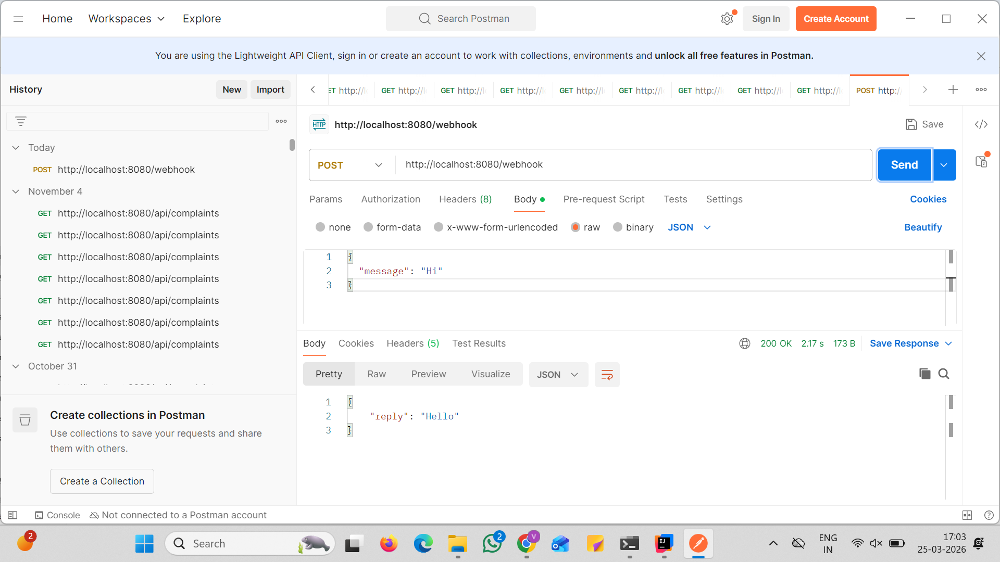
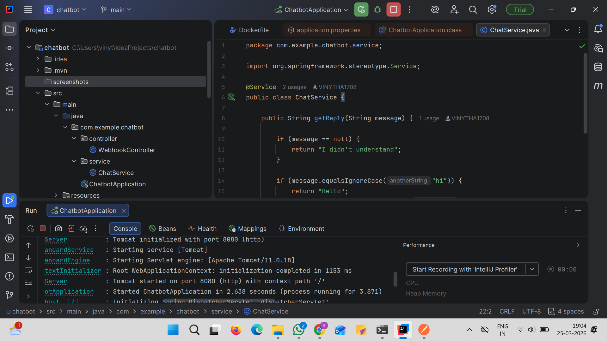
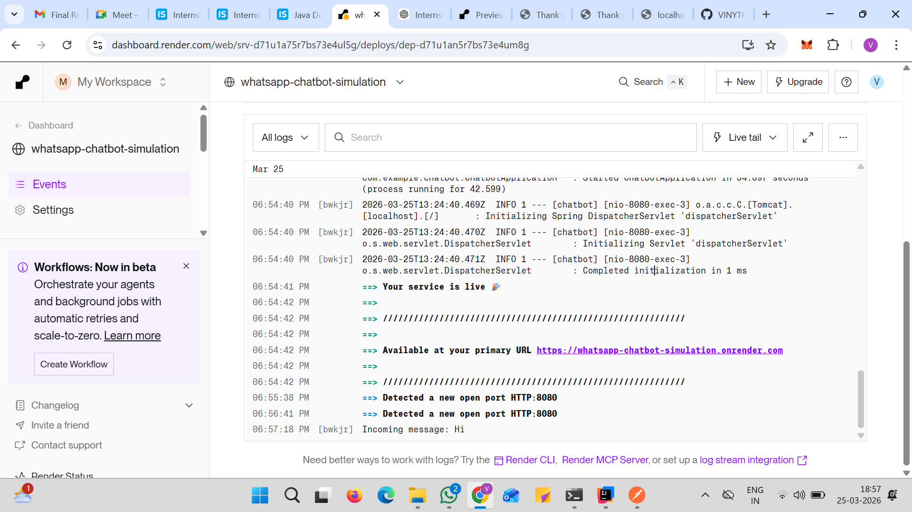
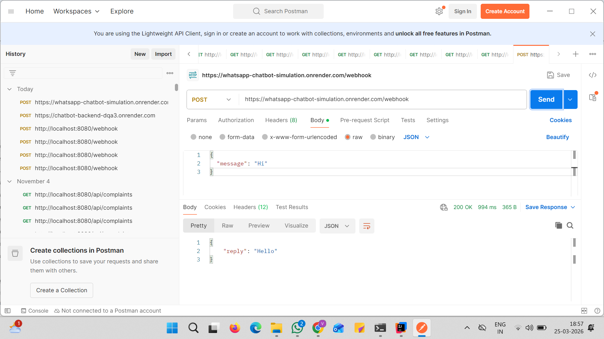

# WhatsApp Chatbot Backend Simulation

## 📌 Project Description

This project is a simple backend simulation of a WhatsApp chatbot built using Java and Spring Boot. It exposes a REST API endpoint that receives messages in JSON format and responds with predefined replies. The application demonstrates basic webhook handling, request processing, and response generation.

---

## 🚀 Features

* REST API endpoint `/webhook`
* Accepts JSON input simulating WhatsApp messages
* Responds with predefined replies:

    * **Hi → Hello**
    * **Bye → Goodbye**
* Logs all incoming messages
* Clean layered architecture (Controller + Service)
* Deployed locally and on cloud (Render)

---

## 🛠️ Tech Stack

* Java (JDK 17+ / 21)
* Spring Boot
* Maven
* REST API
* Postman (for testing)
* Render (for deployment)

---

## 📡 API Endpoint

### 🔹 POST /webhook

### 📥 Request:

```json
{
  "message": "Hi"
}
```

### 📤 Response:

```json
{
  "reply": "Hello"
}
```

---

## ▶️ How to Run Locally

1. Clone the repository:

```bash
git clone https://github.com/VINYTHA1708/whatsapp-chatbot-simulation.git
```

2. Navigate to the project folder:

```bash
cd whatsapp-chatbot-simulation
```

3. Run the application:

```bash
mvn spring-boot:run
```

4. Test using Postman:

```bash
http://localhost:8080/webhook
```

---

## 📸 Screenshots

### 🔹 Local API Test


### 🔹 Console Logs


### 🔹 Render Deployment


### 🔹 Live API Test


---

## 🌐 Live Demo

👉 https://whatsapp-chatbot-simulation.onrender.com/webhook

You can test using Postman or any API client with:

```json
{
  "message": "Hi"
}
```
